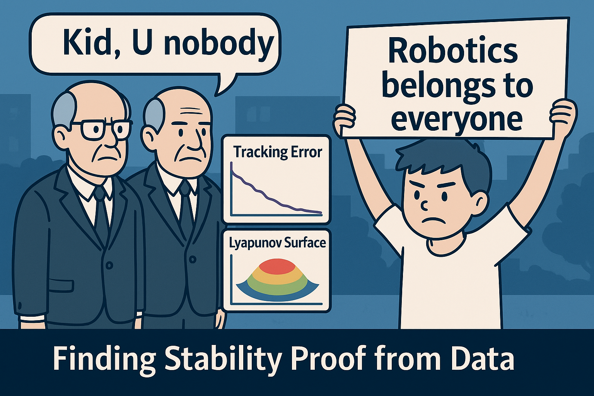

# Finding Stability Proof from Data

> — 😒 *YOU SHOULD DO RESEARCH! —*  
> sneered a postdoc in Robotics while I was working on the data-driven method.
>
> That was when I realized: some so-called authorities dislike new talent.

**This repository takes stability proof out of the hands of authority — and puts it in yours.**


<br>


🌱 **New Talent refuses to beg 🚫 authority — stability in robotics belongs to everyone.**

---

## 💡 What It Does

Given your tracking result, this repository automates the search for a stability proof  
— and updates the stability proof automatically in almost real-time.

<div>    👑 Authority-only math?

&nbsp;&nbsp;&nbsp;&nbsp;&nbsp;&nbsp;&nbsp;&nbsp;&nbsp;&nbsp;- No longer.</div>

<div>    🎲 Blind guessing?

&nbsp;&nbsp;&nbsp;&nbsp;&nbsp;&nbsp;&nbsp;&nbsp;&nbsp;&nbsp;- Gone.</div>

<div>    ❌ Nobody?

&nbsp;&nbsp;&nbsp;&nbsp;&nbsp;&nbsp;&nbsp;&nbsp;&nbsp;&nbsp;- For everyone.</div>

## 🧪 Environment

Before you start, prepare the following:

### Python

- Python 3.8+
- Install dependencies:

```bash
pip install -r requirements.txt
```

### LaTeX

```bash
sudo apt install -y texlive-full
```

## 🚀 Quick Start

Simply run and wait:

```bash
python pipeline.py
```

## 📸 Output Preview

**Result:** 

<br>  

🔥 **Nobody’s authority. Pure data → stability proof.**

---

## 🌐 About This Demo (SaaS User Side)

This repository is the **user-side (usr)** of the Stability Proof SaaS.  

For security and fair usage, the public server is protected by a **global, shared usage limit**  
(i.e., the quota is shared across all users, not per IP or per user).  
  
If the **global quota is exhausted** and the demo no longer runs,  
please contact me directly for extended access or collaboration.

---

## 📬 Contact

**Zhe Shen, Ph.D.**  
Founder, Stable Robotics Ltd. (UK)

- 📧 Email: `zheshen@ieee.org`
- 💼 LinkedIn: `https://www.linkedin.com/in/zhe-shen/`

> This project is developed as part of the Stable Robotics initiative for  
> **data-driven stability certification of real-world control systems**.

